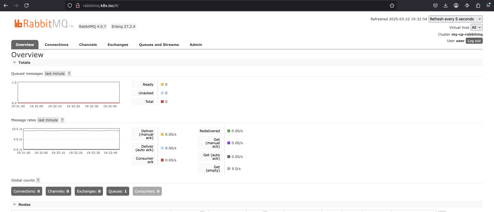
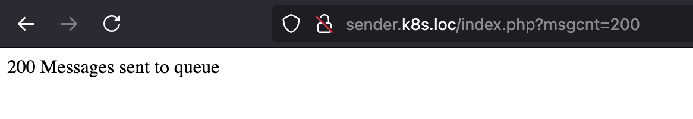
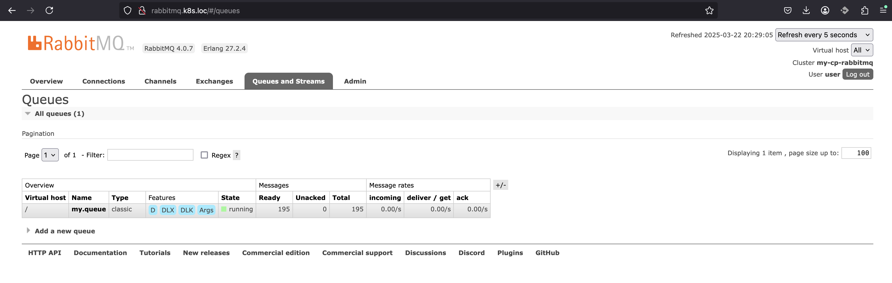
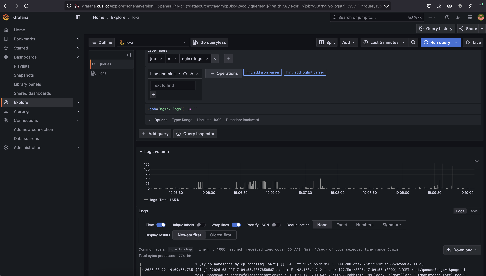
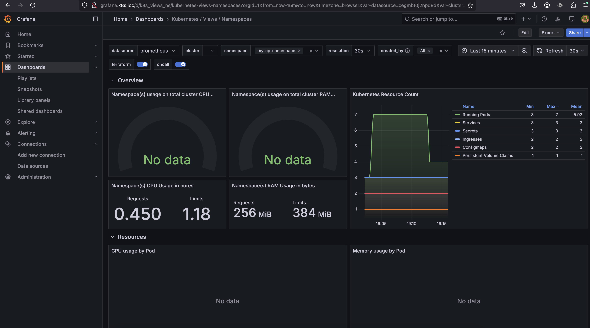
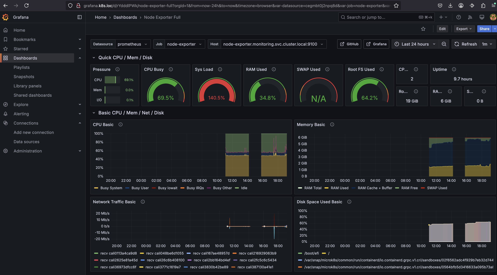
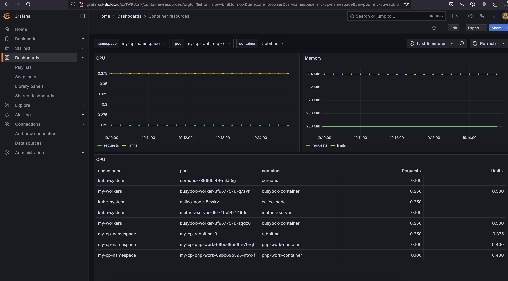

# Bondaruk Victor Course Project

## Опис проекту та його підготування до HELM

Проект складається з 3х компонентів
1. RabbitMQ меседж брокер 
2. PHP Sender використовує два контейнери з nginx та php-fpm. Приймає через http запит на додавання одного або багатьох меседжів у RabbitMQ
3. PHP Worker використовує контейнер з php-fpm. При деплої створює 5 потоків які вибирають меседжи з RabbitMQ та емолюють певну нагрузку на cpu при обробці кожного меседжу. Для цього компоненту налаштований HPA 

---

### Налаштування RabbitMQ

1. Створив неймспейс для проекту
```
sudo microk8s.kubectl create namespace my-cp
namespace/my-cp created
```
2. Встановив bitnamicharts/rabbitmq за допомогою helm
```
helm install my-release oci://registry-1.docker.io/bitnamicharts/rabbitmq -n my-cp
```
3. Додав [ingress](./rabbitmq/ingress.yaml) для RabbitMQ та зааплаів його
```yaml
apiVersion: networking.k8s.io/v1
kind: Ingress
metadata:
  name: rabbitmq-ingress
  namespace: my-cp
  annotations:
    nginx.ingress.kubernetes.io/rewrite-target: /
spec:
  ingressClassName: public
  rules:
    - host: rabbitmq.k8s.loc
      http:
        paths:
          - path: /
            pathType: Prefix
            backend:
              service:
                name: my-release-rabbitmq
                port:
                  number: 15672

```
4. Дістав пароль для входу в панель RabbitMQ
```
sudo microk8s.kubectl get secret --namespace my-cp my-release-rabbitmq -o jsonpath="{.data.rabbitmq-password}" | base64 -d
```
5. Використовуючи імя користувача user та отриманий пароль перевырив роботу веб інтерфейсу RabbitMQ


---

### Налаштування PHP Worker

1. Підготував php [скрипт](./php-work/script.php) котрий виконує задачі моніторингу поду, запускає 5 потоків обробки черги, та власне виконує обробку черг
2. Підготував [deployment](./php-work/deployment.yaml) та зааплаів його
```yaml
apiVersion: apps/v1
kind: Deployment
metadata:
  name: php-work
  namespace: my-cp
spec:
  replicas: 1
  selector:
    matchLabels:
      app: php-work-app
  template:
    metadata:
      labels:
        app: php-work-app
    spec:
      containers:
        - name: php-work-container
          image: bitnami/php-fpm
          env:
            - name: RABBITMQ_PASSWORD #Дістав з secret пароль від RabbitMq
              valueFrom:
                secretKeyRef:
                  name: my-release-rabbitmq
                  key: rabbitmq-password
          readinessProbe: #Скрипт перевіряє чи запушені 5 потоків обробки черги
            exec:
              command:
                - php
                - /app/script.php
                - readiness
            initialDelaySeconds: 5
            periodSeconds: 5
          livenessProbe: #Скрипт перевіряє чи запушені 5 потоків обробки черги
            exec:
              command:
                - php
                - /app/script.php
                - readiness
            failureThreshold: 3
            initialDelaySeconds: 5
            periodSeconds: 5
          resources:
            requests:
              cpu: "100m"
            limits:
              cpu: "400m"
          lifecycle:
            postStart:
              exec: #При старті пода витягується з github код скрипта та запускаеться через нього ініціалізація 5 потоків обробки черги
                command: ["/bin/bash", "-c", "curl -o /app/script.php https://raw.githubusercontent.com/burundtriogeeks/DKHW/refs/heads/main/cp/php-work/script.php && php /app/script.php init"]
```
3. Підготував [hpa](./php-work/hpa.yaml) та зааплаів його
```yaml
apiVersion: autoscaling/v2
kind: HorizontalPodAutoscaler
metadata:
  name: php-worker-hpa
  namespace: my-cp
spec:
  scaleTargetRef:
    apiVersion: apps/v1
    kind: Deployment
    name: php-work
  minReplicas: 1 #Мінімальна кількість реплік
  maxReplicas: 5 #Максимальна кількість реплік
  metrics:
    - type: Resource
      resource:
        name: cpu
        target:
          type: Utilization
          averageUtilization: 40 #Поріг маштабування більше 40% навантаження на виділений ресурс cpu
```
---

### Налаштування PHP Sender
1. Підготував [index.php](./php-sender/index.php) через який можна отримати 1 меседж з черги, або додати 1 меседж в чергу, або додати довільну кількість меседжів в чергу
2. Підготував [configmap](./php-sender/cfgm.yaml) з конфігом nging та додатковим конфіго php-fpm для збереження зміних середовища при запиті через nginx. зааплаів його
```yaml
apiVersion: v1
kind: ConfigMap
metadata:
  name: nginx-config
  namespace: my-cp
data:
  default.conf: |
    server {
        listen 80;
        server_name localhost;
        root /app;
        index index.php index.html index.htm;
        location / {
            try_files $uri $uri/ =404;
        }
        location ~ \.php$ {
            include fastcgi_params;
            fastcgi_pass 127.0.0.1:9000;
            fastcgi_index index.php;
            fastcgi_param SCRIPT_FILENAME $document_root$fastcgi_script_name;
        }
    }
  www.conf: |
    [www]
    user = daemon
    group = daemon
    listen = 9000
    pm = ondemand
    pm.max_children = 5
    pm.start_servers = 2
    pm.min_spare_servers = 1
    pm.max_spare_servers = 3
    clear_env = no
    include=/opt/bitnami/php/etc/environment.conf
    include=/opt/bitnami/php/etc/common.conf
```
3. Підготував [deployment](./php-sender/deployment.yaml) та зааплаів його
```yaml
apiVersion: apps/v1
kind: Deployment
metadata:
  name: php-sender
  namespace: my-cp
spec:
  replicas: 1
  selector:
    matchLabels:
      app: php-sender-app
  template:
    metadata:
      labels:
        app: php-sender-app
    spec:
      containers:
        - name: nginx
          image: nginx:latest
          ports:
            - containerPort: 80
          volumeMounts:
            - name: nginx-config
              mountPath: /etc/nginx/conf.d/default.conf
              subPath: default.conf
        - name: php-sender-container
          image: bitnami/php-fpm
          volumeMounts:
            - name: nginx-config
              mountPath: /opt/bitnami/php/etc/php-fpm.d/www.conf
              subPath: www.conf
          env:
            - name: RABBITMQ_PASSWORD #Передаю з secret пароль до RabbitMQ
              valueFrom:
                secretKeyRef:
                  name: my-release-rabbitmq
                  key: rabbitmq-password
          lifecycle:
            postStart:
              exec: #При старті пода дістаю з github останю версію idex.php
                command: ["/bin/bash", "-c", "curl -o /app/index.php https://raw.githubusercontent.com/burundtriogeeks/DKHW/refs/heads/main/cp/php-sender/index.php"]
      volumes:
        - name: nginx-config
          configMap:
            name: nginx-config
```
4. Підготував [service](./php-sender/service.yaml) та [ingress](./php-sender/ingress.yaml). Задеплоів їх
```yaml
apiVersion: v1
kind: Service
metadata:
  name: php-sender-service
  namespace: my-cp
spec:
  selector:
    app: php-sender-app
  ports:
    - protocol: TCP
      port: 80

```
```yaml
apiVersion: networking.k8s.io/v1
kind: Ingress
metadata:
  name: php-sender-ingress
  namespace: my-cp
  annotations:
    nginx.ingress.kubernetes.io/rewrite-target: /
spec:
  ingressClassName: public
  rules:
    - host: sender.k8s.loc
      http:
        paths:
          - path: /
            pathType: Prefix
            backend:
              service:
                name: php-sender-service
                port:
                  number: 80
```
---

## Створення HELM Chart

Виконавши усі перевірки чорнової збоки я перейшов до створення Helm Chart

1. Видалив весь тестовий проек через неймспей
```
sudo microk8s.kubectl delete namespaces my-cp
```

2. Створив робочу [директорію](./my-helm)
3. Cтворив новий chart та видалив усі зайві файли
```
helm create my-helm-chart
```
4. Підготував [Chart.yaml](./my-helm/my-helm-chart/Chart.yaml) з вказанням залежності від bitnami/rabbitmq
```yaml
apiVersion: v2
name: my-helm-chart
description: A Helm chart for my Kubernetes course project
type: application
version: 0.1.0
appVersion: "1.16.0"
dependencies:
  - name: rabbitmq
    version: 15.4.0
    repository: https://charts.bitnami.com/bitnami
```
5. Підготував [values.yaml](./my-helm/my-helm-chart/values.yaml). Важливо вказати на машині з якої будуть проводитись тести в /etc/hosts хостнейм для php sender та RabbitMQ
```yaml
php:
  php_image:
    repository: bitnami/php-fpm #image для php-fpm
    tag: latest #його тег
  nginx_image:
    repository: nginx #image для nginx
    tag: latest #його тег
  ingress:
    hostname: sender.k8s.loc #хостнейм для доступу до інструменту відправки меседжів в чергу
  hpa:
    minReplicas: 1 #Мінімальна кількість реплік для HPA
    maxReplicas: 5 #Максимальна кількість реплік для HPA

rabbitmq:
  ingress:
    hostname: rabbitmq.k8s.loc #хостнейм для доступу до панелі керуваня RabbitMQ 
```

6. Зібрав усі створені раніше маніфести в папку [templates](./my-helm/my-helm-chart/templates/). Замінив маніфести з використання шаблонів хелм
### [rabbitmq_ingress.yaml](./my-helm/my-helm-chart/templates/rabbitmq_ingress.yaml)
```yaml
apiVersion: networking.k8s.io/v1
kind: Ingress
metadata:
  name: {{ .Release.Name }}-rabbitmq-ingress
  annotations:
    nginx.ingress.kubernetes.io/rewrite-target: /
spec:
  ingressClassName: public
  rules:
    - host: {{ .Values.rabbitmq.ingress.hostname }}
      http:
        paths:
          - path: /
            pathType: Prefix
            backend:
              service:
                name: {{ .Release.Name }}-rabbitmq
                port:
                  number: 15672
```

### [sender_cfgm.yaml](./my-helm/my-helm-chart/templates/sender_cfgm.yaml)
```yaml
apiVersion: v1
kind: ConfigMap
metadata:
  name: {{ .Release.Name }}-nginx-config
data:
  default.conf: |
    server {
        listen 80;
        server_name localhost;
        root /app;
        index index.php index.html index.htm;
        location / {
            try_files $uri $uri/ =404;
        }
        location ~ \.php$ {
            include fastcgi_params;
            fastcgi_pass 127.0.0.1:9000;
            fastcgi_index index.php;
            fastcgi_param SCRIPT_FILENAME $document_root$fastcgi_script_name;
        }
    }
  www.conf: |
    [www]
    user = daemon
    group = daemon
    listen = 9000
    pm = ondemand
    pm.max_children = 5
    pm.start_servers = 2
    pm.min_spare_servers = 1
    pm.max_spare_servers = 3
    clear_env = no
    include=/opt/bitnami/php/etc/environment.conf
    include=/opt/bitnami/php/etc/common.conf
```

### [sender_deployment.yaml](./my-helm/my-helm-chart/templates/sender_deployment.yaml)
```yaml
apiVersion: apps/v1
kind: Deployment
metadata:
  name: {{ .Release.Name }}-php-sender
spec:
  replicas: 1
  selector:
    matchLabels:
      app: php-sender-app
  template:
    metadata:
      labels:
        app: php-sender-app
    spec:
      containers:
        - name: nginx
          image: {{ .Values.php.nginx_image.repository }}:{{ .Values.php.nginx_image.tag }}
          ports:
            - containerPort: 80
          volumeMounts:
            - name: nginx-config
              mountPath: /etc/nginx/conf.d/default.conf
              subPath: default.conf
        - name: php-sender-container
          image: {{ .Values.php.php_image.repository }}:{{ .Values.php.php_image.tag }}
          volumeMounts:
            - name: nginx-config
              mountPath: /opt/bitnami/php/etc/php-fpm.d/www.conf
              subPath: www.conf
          env:
            - name: RABBITMQ_PASSWORD
              valueFrom:
                secretKeyRef:
                  name: {{ .Release.Name }}-rabbitmq
                  key: rabbitmq-password
            - name: RABBITMQ_HOST
              value: {{ .Release.Name }}-rabbitmq.{{ .Release.Namespace }}.svc.cluster.local
          lifecycle:
            postStart:
              exec:
                command: ["/bin/bash", "-c", "curl -o /app/index.php https://raw.githubusercontent.com/burundtriogeeks/DKHW/refs/heads/main/cp/php-sender/index.php"]
      volumes:
        - name: nginx-config
          configMap:
            name: {{ .Release.Name }}-nginx-config
```

### [sender_service.yaml](./my-helm/my-helm-chart/templates/sender_service.yaml)
```yaml
apiVersion: v1
kind: Service
metadata:
  name: {{ .Release.Name }}-php-sender-service
spec:
  selector:
    app: php-sender-app
  ports:
    - protocol: TCP
      port: 80
```

### [sender_ingress.yaml](./my-helm/my-helm-chart/templates/sender_ingress.yaml)
```yaml
apiVersion: networking.k8s.io/v1
kind: Ingress
metadata:
  name: {{ .Release.Name }}-php-sender-ingress
  annotations:
    nginx.ingress.kubernetes.io/rewrite-target: /
spec:
  ingressClassName: public
  rules:
    - host: {{ .Values.php.ingress.hostname }}
      http:
        paths:
          - path: /
            pathType: Prefix
            backend:
              service:
                name: {{ .Release.Name }}-php-sender-service
                port:
                  number: 80
```

### [worker_deployment.yaml](./my-helm/my-helm-chart/templates/worker_deployment.yaml)
```yaml
apiVersion: apps/v1
kind: Deployment
metadata:
  name: {{ .Release.Name }}-php-work
spec:
  replicas: 1
  selector:
    matchLabels:
      app: php-work-app
  template:
    metadata:
      labels:
        app: php-work-app
    spec:
      containers:
        - name: php-work-container
          image: {{ .Values.php.php_image.repository }}:{{ .Values.php.php_image.tag }}
          resources:
            requests:
              cpu: "100m"
            limits:
              cpu: "400m"
          env:
            - name: RABBITMQ_PASSWORD
              valueFrom:
                secretKeyRef:
                  name: {{ .Release.Name }}-rabbitmq
                  key: rabbitmq-password
            - name: RABBITMQ_HOST
              value: {{ .Release.Name }}-rabbitmq.{{ .Release.Namespace }}.svc.cluster.local
          readinessProbe:
            exec:
              command:
                - php
                - /app/script.php
                - readiness
            initialDelaySeconds: 5
            periodSeconds: 5
          livenessProbe:
            exec:
              command:
                - php
                - /app/script.php
                - readiness
            failureThreshold: 3
            initialDelaySeconds: 5
            periodSeconds: 5
          lifecycle:
            postStart:
              exec:
                command: ["/bin/bash", "-c", "curl -o /app/script.php https://raw.githubusercontent.com/burundtriogeeks/DKHW/refs/heads/main/cp/php-work/script.php && php /app/script.php init"]
```

### [worker_hpa.yaml](./my-helm/my-helm-chart/templates/worker_hpa.yaml)
```yaml
apiVersion: autoscaling/v2
kind: HorizontalPodAutoscaler
metadata:
  name: {{ .Release.Name }}-php-worker-hpa
spec:
  scaleTargetRef:
    apiVersion: apps/v1
    kind: Deployment
    name: {{ .Release.Name }}-php-work
  minReplicas: {{ .Values.php.hpa.minReplicas }}
  maxReplicas: {{ .Values.php.hpa.maxReplicas }}
  metrics:
    - type: Resource
      resource:
        name: cpu
        target:
          type: Utilization
          averageUtilization: 40
```

7. Оновив депенденсі для свого чарту
```
helm dependency update my-helm-chart/
Getting updates for unmanaged Helm repositories...
...Successfully got an update from the "https://charts.bitnami.com/bitnami" chart repository
Saving 1 charts
Downloading rabbitmq from repo https://charts.bitnami.com/bitnami
Pulled: registry-1.docker.io/bitnamicharts/rabbitmq:15.4.0
Digest: sha256:5e3a3c31e2d9fc8265c49fcd4aceabda73fec50b27550bc327ea5cfe02
```

8. Інсталював свій helm chart та перевірив що створилось в kubernetes
```
helm install my-cp ./my-helm-chart/ -n my-cp-namespace --create-namespace
```
```
sudo microk8s.kubectl get all -n my-cp-namespace
NAME                                    READY   STATUS    RESTARTS      AGE
pod/my-cp-php-sender-5c878c5df9-6xfv9   2/2     Running   3 (64m ago)   84m
pod/my-cp-php-work-69bc69b595-79rql     1/1     Running   2 (64m ago)   83m
pod/my-cp-rabbitmq-0                    1/1     Running   1 (64m ago)   84m

NAME                               TYPE        CLUSTER-IP       EXTERNAL-IP   PORT(S)                                 AGE
service/my-cp-php-sender-service   ClusterIP   **************   <none>        80/TCP                                  84m
service/my-cp-rabbitmq             ClusterIP   **************   <none>        5672/TCP,4369/TCP,25672/TCP,15672/TCP   84m
service/my-cp-rabbitmq-headless    ClusterIP   None             <none>        4369/TCP,5672/TCP,25672/TCP,15672/TCP   84m

NAME                               READY   UP-TO-DATE   AVAILABLE   AGE
deployment.apps/my-cp-php-sender   1/1     1            1           84m
deployment.apps/my-cp-php-work     1/1     1            1           84m

NAME                                          DESIRED   CURRENT   READY   AGE
replicaset.apps/my-cp-php-sender-5c878c5df9   1         1         1       84m
replicaset.apps/my-cp-php-work-69bc69b595     1         1         1       84m

NAME                              READY   AGE
statefulset.apps/my-cp-rabbitmq   1/1     84m

NAME                                                       REFERENCE                   TARGETS        MINPODS   MAXPODS   REPLICAS   AGE
horizontalpodautoscaler.autoscaling/my-cp-php-worker-hpa   Deployment/my-cp-php-work   cpu: 15%/40%   1         5         1          84m
```

9. Зайшов зі свого компьютера в браузері на http://sender.k8s.loc/index.php?msgcnt=200. Це створює 200 меседжів в черзі

10. Перевірив кількість повідомлень на RabbitMQ 

11. Почав спостерігати як HPA збільшує кількість реплік для розбору черги, та даунскейлиться після виконнаня роботи

```
sudo microk8s.kubectl get hpa -n my-cp-namespace
NAME                   REFERENCE                   TARGETS        MINPODS   MAXPODS   REPLICAS   AGE
my-cp-php-worker-hpa   Deployment/my-cp-php-work   cpu: 81%/40%   1         5         1          87m

sudo microk8s.kubectl get hpa -n my-cp-namespace
NAME                   REFERENCE                   TARGETS         MINPODS   MAXPODS   REPLICAS   AGE
my-cp-php-worker-hpa   Deployment/my-cp-php-work   cpu: 225%/40%   1         5         3          87m

sudo microk8s.kubectl get hpa -n my-cp-namespace
NAME                   REFERENCE                   TARGETS         MINPODS   MAXPODS   REPLICAS   AGE
my-cp-php-worker-hpa   Deployment/my-cp-php-work   cpu: 205%/40%   1         5         5          87m

sudo microk8s.kubectl get hpa -n my-cp-namespace
NAME                   REFERENCE                   TARGETS        MINPODS   MAXPODS   REPLICAS   AGE
my-cp-php-worker-hpa   Deployment/my-cp-php-work   cpu: 11%/40%   1         5         2          92m

sudo microk8s.kubectl get hpa -n my-cp-namespace
NAME                   REFERENCE                   TARGETS        MINPODS   MAXPODS   REPLICAS   AGE
my-cp-php-worker-hpa   Deployment/my-cp-php-work   cpu: 7%/40%   1         5         1          94m
```

---
## Налаштування моніторингу

Для моніторингу я використав [запущені](../hw11/README.md) раніше loki,fluentbit,prometheus,grafana

### Збір логів в loki


### Моніторинг кластеру


### Моніторинг ноди


### Моніторинг подів
