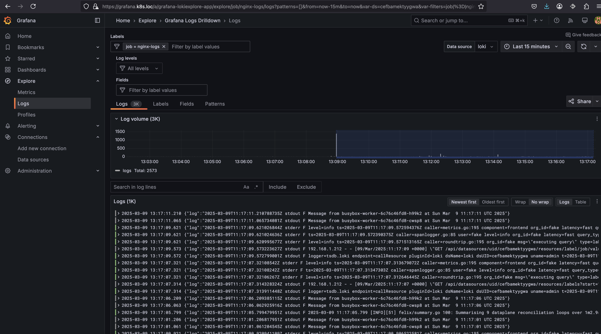
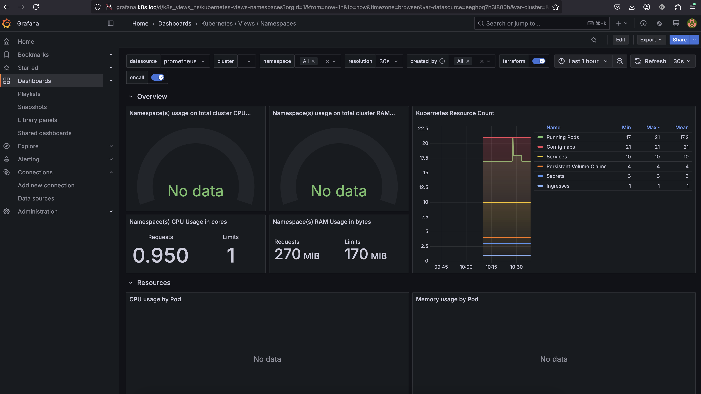
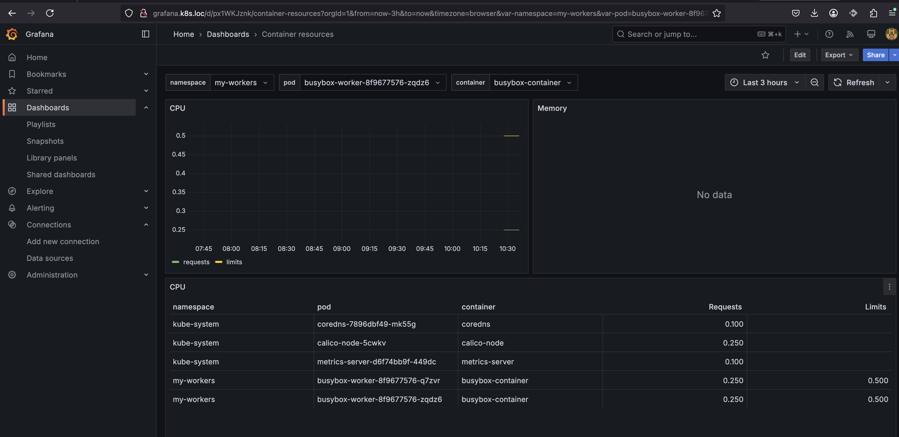

# HW11 Bondaruk Victor

## Деплой busybox

1. Створив неймспейс для подів busybox

```
sudo microk8s.kubectl create namespace my-workers
namespace/my-workers created
```

2. Підготував Config Map [busybox/cfgm.yaml](./busybox/cfgm.yaml), Persistent Volume [busybox/pv.yaml](./busybox/pv.yaml), Persistent Volume Claim [busybox/pvc.yaml](./busybox/pvc.yaml) та Deployment [busybox/deployment.yaml](./busybox/deployment.yaml)

```yaml
apiVersion: v1 #Версія апі до якого іде звернення
kind: ConfigMap #Тип апі до якого іде звернення
metadata:
  name: busybox-config #Назва конфіг мапу
  namespace: my-workers #Назва неймспейсу
data: #Список у форматі ключ : значення
  LOG_FILE: "/home/log/my_log.log"
```

```yaml
apiVersion: v1 #Версія апі до якого іде звернення
kind: PersistentVolume #Тип апі до якого іде звернення
metadata:
  name: busybox-pv #Назва pv
spec:
  capacity:
    storage: 1Gi #Розмір волума
  accessModes:
    - ReadWriteOnce #Може бути використаний для запису та читання на подах у рамках однієї ноди
  persistentVolumeReclaimPolicy: Retain #Вказуэ на те, що усі дані будуть збережені при видалені усіх клеймів
  storageClassName: microk8s-hostpath #Клас стореджу. У нашому вибадку збереження на хості
  hostPath:
    path: "/mnt/data/busybox" #Фізична папка з волумом
```

```yaml
apiVersion: v1 #Версія апі до якого іде звернення
kind: PersistentVolumeClaim #Тип апі до якого іде звернення
metadata:
  name: busybox-pvc #Назва pvc
  namespace: my-workers #Назва неймспейсу
spec:
  accessModes:
    - ReadWriteOnce #Може бути використаний для запису та читання на подах у рамках однієї ноди
  resources:
    requests:
      storage: 1Gi #Розмір волума
  storageClassName: microk8s-hostpath #Клас стореджу. У нашому вибадку збереження на хості
```

```yaml
apiVersion: apps/v1 #Версія апі до якого іде звернення
kind: Deployment  #Тип апі до якого іде звернення
metadata:
  name: busybox-worker #Назва деплойменту
  namespace: my-workers #Назва неймспейсу
spec:
  replicas: 3 #Кількість подів які будуть розгорнуті
  selector:
    matchLabels:
      app: busybox-app #Селектор лейблів подів які підлягають під цей деплойймент
  template: #Опис подів
    metadata:
      labels:
        app: busybox-app #Лейбла поду, використовується для деплойменту і для сервісів
    spec:
      containers:
        - name: busybox-container  #Назва поду
          image: busybox #Імедж який встановлюється в под
          command: ["/bin/sh"] #Команда котра буде виконана в контейнері
          resources: #Вимоги до ресурсів
            requests:
              cpu: "250m" #Робимо запит на 0.25 CPU
            limits:
              cpu: "500m" #ставимо ліміт в 0.5 CPU
          args: ["-c", "while true; do echo \"Message from $(hostname) at $(date)\" | tee -a $LOG_FILE; sleep 5; done"] #Аргументи до попередньої команди
          volumeMounts:
            - name: busybox-storage #Імя волума який підєднуємо. Розділ volumes далі
              mountPath: /home/log/ #Шлях куди ми підєднуємо волум
          env: #Імпортуємо потрібний ключ з конфіг мапи у змінні середовища
            - name: LOG_FILE #Імя змінної середовища
              valueFrom:
                configMapKeyRef:
                  name: busybox-config #Імя конфіг мап
                  key: LOG_FILE #Імя ключа у конфіг мап
      volumes: #Список волумів
        - name: busybox-storage #Імя волума яке використовувалось при описі контейнеру
          persistentVolumeClaim: #Тип або клейм або конфігмап
            claimName: busybox-pvc #Імя клейму
```
3. Виконав apply попередніх маніфестів

```
sudo microk8s.kubectl apply -f ./busybox/cfgm.yaml
configmap/busybox-config created

sudo microk8s.kubectl apply -f ./busybox/pv.yaml
persistentvolume/busybox-pv created

sudo microk8s.kubectl apply -f ./busybox/pvc.yaml
persistentvolumeclaim/busybox-pvc created

sudo microk8s.kubectl apply -f ./busybox/deployment.yaml 
deployment.apps/busybox-worker created
```

---
## Скейл busybox
1. Перевірив запущені поди та зміст загального файлу логів

```
sudo microk8s.kubectl get pods -n my-workers
NAME                             READY   STATUS    RESTARTS   AGE
busybox-worker-96d7c54b8-4775t   1/1     Running   0          15s
busybox-worker-96d7c54b8-7fj7k   1/1     Running   0          15s
busybox-worker-96d7c54b8-p4f4j   1/1     Running   0          15s

tail -f /mnt/data/busybox/my_log.log
Message from busybox-worker-96d7c54b8-4775t at Sun Mar  9 09:28:31 UTC 2025
Message from busybox-worker-96d7c54b8-7fj7k at Sun Mar  9 09:28:36 UTC 2025
Message from busybox-worker-96d7c54b8-4775t at Sun Mar  9 09:28:36 UTC 2025
Message from busybox-worker-96d7c54b8-p4f4j at Sun Mar  9 09:28:36 UTC 2025
Message from busybox-worker-96d7c54b8-7fj7k at Sun Mar  9 09:28:41 UTC 2025
Message from busybox-worker-96d7c54b8-4775t at Sun Mar  9 09:28:41 UTC 2025
Message from busybox-worker-96d7c54b8-p4f4j at Sun Mar  9 09:28:41 UTC 2025
Message from busybox-worker-96d7c54b8-7fj7k at Sun Mar  9 09:28:46 UTC 2025
Message from busybox-worker-96d7c54b8-p4f4j at Sun Mar  9 09:28:46 UTC 2025
Message from busybox-worker-96d7c54b8-4775t at Sun Mar  9 09:28:46 UTC 2025
```

2. Виконав скейл подів до 6, перевірив список подів, та переконався нові поди також зберігають свої логи у файл

```
sudo microk8s.kubectl scale deployment busybox-worker --replicas=6 -n my-workers
deployment.apps/busybox-worker scaled

sudo microk8s.kubectl get pods -n my-workers
NAME                             READY   STATUS    RESTARTS   AGE
busybox-worker-96d7c54b8-4775t   1/1     Running   0          12m
busybox-worker-96d7c54b8-7fj7k   1/1     Running   0          12m
busybox-worker-96d7c54b8-9q8lp   1/1     Running   0          32s
busybox-worker-96d7c54b8-l6ldk   1/1     Running   0          32s
busybox-worker-96d7c54b8-p4f4j   1/1     Running   0          12m
busybox-worker-96d7c54b8-q9z27   1/1     Running   0          32s

tail -f /mnt/data/busybox/my_log.log
Message from busybox-worker-96d7c54b8-q9z27 at Sun Mar  9 09:32:14 UTC 2025
Message from busybox-worker-96d7c54b8-7fj7k at Sun Mar  9 09:32:16 UTC 2025
Message from busybox-worker-96d7c54b8-4775t at Sun Mar  9 09:32:16 UTC 2025
Message from busybox-worker-96d7c54b8-p4f4j at Sun Mar  9 09:32:16 UTC 2025
Message from busybox-worker-96d7c54b8-9q8lp at Sun Mar  9 09:32:19 UTC 2025
Message from busybox-worker-96d7c54b8-l6ldk at Sun Mar  9 09:32:19 UTC 2025
Message from busybox-worker-96d7c54b8-q9z27 at Sun Mar  9 09:32:19 UTC 2025
Message from busybox-worker-96d7c54b8-7fj7k at Sun Mar  9 09:32:21 UTC 2025
Message from busybox-worker-96d7c54b8-p4f4j at Sun Mar  9 09:32:21 UTC 2025
Message from busybox-worker-96d7c54b8-4775t at Sun Mar  9 09:32:21 UTC 2025
Message from busybox-worker-96d7c54b8-9q8lp at Sun Mar  9 09:32:24 UTC 2025
Message from busybox-worker-96d7c54b8-l6ldk at Sun Mar  9 09:32:24 UTC 2025
Message from busybox-worker-96d7c54b8-q9z27 at Sun Mar  9 09:32:24 UTC 2025
Message from busybox-worker-96d7c54b8-7fj7k at Sun Mar  9 09:32:26 UTC 2025
Message from busybox-worker-96d7c54b8-p4f4j at Sun Mar  9 09:32:26 UTC 2025
Message from busybox-worker-96d7c54b8-4775t at Sun Mar  9 09:32:26 UTC 2025
Message from busybox-worker-96d7c54b8-9q8lp at Sun Mar  9 09:32:29 UTC 2025
Message from busybox-worker-96d7c54b8-l6ldk at Sun Mar  9 09:32:29 UTC 2025
Message from busybox-worker-96d7c54b8-q9z27 at Sun Mar  9 09:32:29 UTC 2025
Message from busybox-worker-96d7c54b8-7fj7k at Sun Mar  9 09:32:31 UTC 2025
Message from busybox-worker-96d7c54b8-p4f4j at Sun Mar  9 09:32:31 UTC 2025
Message from busybox-worker-96d7c54b8-4775t at Sun Mar  9 09:32:31 UTC 2025
```
3. Виконав давнскейл подів до 2
```
sudo microk8s.kubectl scale deployment busybox-worker --replicas=2 -n my-workers
deployment.apps/busybox-worker scaled

sudo microk8s.kubectl get pods -n my-workers
NAME                             READY   STATUS        RESTARTS   AGE
busybox-worker-96d7c54b8-4775t   1/1     Running       0          13m
busybox-worker-96d7c54b8-7fj7k   1/1     Running       0          13m
busybox-worker-96d7c54b8-9q8lp   1/1     Terminating   0          94s
busybox-worker-96d7c54b8-l6ldk   1/1     Terminating   0          94s
busybox-worker-96d7c54b8-p4f4j   1/1     Terminating   0          13m
busybox-worker-96d7c54b8-q9z27   1/1     Terminating   0          94s
```
---
## HPA

1. Налаштував HPA для деплою busybox-worker та перевірив його статус
```
sudo microk8s.kubectl autoscale deployment busybox-worker --cpu-percent=50 --min=2 --max=4 -n my-workers
horizontalpodautoscaler.autoscaling/busybox-worker autoscaled

sudo microk8s.kubectl get hpa -n my-workers
NAME             REFERENCE                   TARGETS       MINPODS   MAXPODS   REPLICAS   AGE
busybox-worker   Deployment/busybox-worker   cpu: 0%/50%   2         4         3          69s
```

2. Створив навантаження на одному з подів та дочекався автоматичного сейлу до 4 подів

```
sudo microk8s.kubectl top pods -n my-workers
NAME                              CPU(cores)   MEMORY(bytes)   
busybox-worker-6c76c46fd8-cwsp8   1m           0Mi             
busybox-worker-6c76c46fd8-h99k2   500m         2Mi             
busybox-worker-6c76c46fd8-jv6fk   1m           0Mi  

sudo microk8s.kubectl get hpa -n my-workers
NAME             REFERENCE                   TARGETS        MINPODS   MAXPODS   REPLICAS   AGE
busybox-worker   Deployment/busybox-worker   cpu: 66%/50%   2         4         3          2m36s

sudo microk8s.kubectl get pods -n my-workers
NAME                              READY   STATUS    RESTARTS   AGE
busybox-worker-6c76c46fd8-9dntx   1/1     Running   0          45s
busybox-worker-6c76c46fd8-cwsp8   1/1     Running   0          9m42s
busybox-worker-6c76c46fd8-h99k2   1/1     Running   0          9m42s
busybox-worker-6c76c46fd8-jv6fk   1/1     Running   0          9m42s

sudo microk8s.kubectl describe hpa busybox-worker -n my-workers
Name:                                                  busybox-worker
Namespace:                                             my-workers
Labels:                                                <none>
Annotations:                                           <none>
CreationTimestamp:                                     Sun, 09 Mar 2025 09:57:24 +0000
Reference:                                             Deployment/busybox-worker
Metrics:                                               ( current / target )
  resource cpu on pods  (as a percentage of request):  0% (1m) / 50%
Min replicas:                                          2
Max replicas:                                          4
Deployment pods:                                       4 current / 4 desired
Conditions:
  Type            Status  Reason               Message
  ----            ------  ------               -------
  AbleToScale     True    ScaleDownStabilized  recent recommendations were higher than current one, applying the highest recent recommendation
  ScalingActive   True    ValidMetricFound     the HPA was able to successfully calculate a replica count from cpu resource utilization (percentage of request)
  ScalingLimited  False   DesiredWithinRange   the desired count is within the acceptable range
Events:
  Type    Reason             Age    From                       Message
  ----    ------             ----   ----                       -------
  Normal  SuccessfulRescale  3m51s  horizontal-pod-autoscaler  New size: 4; reason: cpu resource utilization (percentage of request) above target
```

3. Зупинив навантаження та дочекався довнскейлу до 2х подів

```

sudo microk8s.kubectl get hpa -n my-workers
NAME             REFERENCE                   TARGETS       MINPODS   MAXPODS   REPLICAS   AGE
busybox-worker   Deployment/busybox-worker   cpu: 0%/50%   2         4         2          10m

sudo microk8s.kubectl describe hpa busybox-worker -n my-workers
Name:                                                  busybox-worker
Namespace:                                             my-workers
Labels:                                                <none>
Annotations:                                           <none>
CreationTimestamp:                                     Sun, 09 Mar 2025 09:57:24 +0000
Reference:                                             Deployment/busybox-worker
Metrics:                                               ( current / target )
  resource cpu on pods  (as a percentage of request):  0% (1m) / 50%
Min replicas:                                          2
Max replicas:                                          4
Deployment pods:                                       2 current / 2 desired
Conditions:
  Type            Status  Reason            Message
  ----            ------  ------            -------
  AbleToScale     True    ReadyForNewScale  recommended size matches current size
  ScalingActive   True    ValidMetricFound  the HPA was able to successfully calculate a replica count from cpu resource utilization (percentage of request)
  ScalingLimited  True    TooFewReplicas    the desired replica count is less than the minimum replica count
Events:
  Type    Reason             Age   From                       Message
  ----    ------             ----  ----                       -------
  Normal  SuccessfulRescale  49s   horizontal-pod-autoscaler  New size: 2; reason: All metrics below target 
```
---
## Налаштування моніторінгу
1. Створив неймспейс monitoring та зробив apply маніфестів для Loki [./loki/pv.yaml](./loki/pv.yaml), [./loki/pvc.yaml](./loki/pvc.yaml), [./loki/cfgm.yaml](./loki/cfgm.yaml), [./loki/deployment.yaml](./loki/deployment.yaml), [./loki/service.yaml](./loki/service.yaml). Додатково змінив права на 777 для PV /mnt/data/loki
```
sudo microk8s.kubectl create namespace monitoring
namespace/monitoring created

sudo microk8s.kubectl apply -f ./loki/pv.yaml
persistentvolume/loki-pv created

sudo microk8s.kubectl apply -f ./loki/pvc.yaml
persistentvolumeclaim/loki-pvc created

sudo mkdir /mnt/data/loki
sudo chmod -R 777 /mnt/data/loki

sudo microk8s.kubectl apply -f ./loki/cfgm.yaml
configmap/loki-config created

sudo microk8s.kubectl apply -f ./loki/deployment.yaml
deployment.apps/loki created

sudo microk8s.kubectl apply -f ./loki/service.yaml 
service/loki created
```
2. Перевірив роботу локі з хоста та з busybox
```
sudo microk8s.kubectl get service -n monitoring
NAME   TYPE        CLUSTER-IP       EXTERNAL-IP   PORT(S)    AGE
loki   ClusterIP   10.152.183.194   <none>        3100/TCP   98s

curl http://10.152.183.194:3100/ready
ready

sudo microk8s.kubectl exec -it busybox-worker-6c76c46fd8-cwsp8  -n my-workers -- sh
/ # wget -qO- http://loki.monitoring.svc.cluster.local:3100/ready
ready
```

3. Зробив apply маніфестів FluentBit [./fluentbit/cfgm.yaml](./fluentbit/cfgm.yaml), [./fluentbit/deamon.yaml](./fluentbit/deamon.yaml)
```
sudo microk8s.kubectl apply -f ./fluentbit/cfgm.yaml 
configmap/fluentbit-config created

sudo microk8s.kubectl apply -f ./fluentbit/deamon.yaml
daemonset.apps/fluentbit created
```
4. Зробив apply маніфестів Grafana [./grafana/deployment.yaml](./grafana/deployment.yaml), [./grafana/service.yaml](./grafana/service.yaml), [./grafana/ingress.yaml](./grafana/ingress.yaml)
```
sudo microk8s.kubectl apply -f ./grafana/deployment.yaml
deployment.apps/grafana created

sudo microk8s.kubectl apply -f ./grafana/service.yaml
service/grafana created

sudo microk8s.kubectl apply -f ./grafana/ingress.yaml
ingress.networking.k8s.io/grafana-ingress created
```
5. Перевірив роботу Grafana та наявність у ній логів з busybox


### Налаштування Prometheus

1. Підготував для Prometheus ConfigMap [./prometheus/cfgm.yaml](./prometheus/cfgm.yaml) де вказані налаштування скраперу для збору метрик нодів та кластеру кубернетс, [./prometheus/deployment.yaml](./prometheus/deployment.yaml), [./prometheus/service.yaml](./prometheus/service.yaml). Зааплаїв маніфести
```
sudo microk8s.kubectl apply -f ./prometheus/cfgm.yaml
configmap/prometheus-config created

sudo microk8s.kubectl apply -f ./prometheus/deployment.yaml
deployment.apps/prometheus created

sudo microk8s.kubectl apply -f ./prometheus/service.yaml
service/prometheus created
```
2. Підготував та зааплаїв пак маніфестів для збору метрик кластеру кубернетс [./prometheus/kube-state-metrics.yaml](./prometheus/kube-state-metrics.yaml)
```
sudo microk8s.kubectl apply -f ./prometheus/kube-state-metrics.yaml
serviceaccount/kube-state-metrics created
clusterrole.rbac.authorization.k8s.io/kube-state-metrics created
clusterrolebinding.rbac.authorization.k8s.io/kube-state-metrics created
deployment.apps/kube-state-metrics created
service/kube-state-metrics created
```
3. Підготував та зааплаїв пак маніфестів для збору метрик з кожної ноди кластеру кубернетс [./prometheus/node-exporter.yaml](./prometheus/node-exporter.yaml)
```
sudo microk8s.kubectl apply -f ./prometheus/node-exporter.yaml
daemonset.apps/node-exporter created
service/node-exporter created
```
4. Додав у графана датасорс прометеус, імпортував дашборди та перевірив збір інформації под нодам, кластеру, та подам


