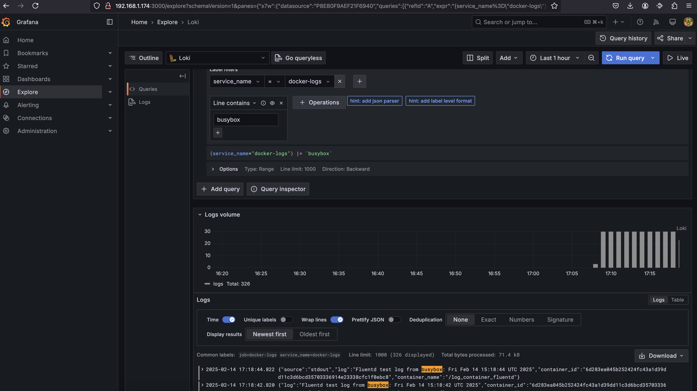

# HW6 Bondaruk Victor

1. Створюю власну мережу bridge
```
sudo docker network create --driver bridge my_bridge_network
sudo docker network ls
NETWORK ID     NAME                DRIVER    SCOPE
bb8c2960a2ab   bridge              bridge    local
82cca984f796   host                host      local
dafbcffafb04   my_bridge_network   bridge    local
e8ac68df38e2   none                null      local
```

2. Створюю image fluentd (+loki plugin) зі свого [Dockerfile](Dockerfile)
```
sudo docker build -t fluentd-loki ./
sudo docker images
REPOSITORY       TAG                    IMAGE ID       CREATED          SIZE
fluentd-loki     latest                 c0074b8925d0   16 seconds ago   230MB
fluent/fluentd   v1.16-debian-arm64-1   46f7c1631bf2   5 months ago     230MB
```

3. Запустив контейнер з fluentd
```
sudo docker run -d --name fluentd \
  --network my_bridge_network \
  -v $(pwd)/fluentd.conf:/fluentd/etc/fluent.conf \
  -p 24224:24224 -p 24224:24224/udp \
  fluentd-loki
sudo docker ps
CONTAINER ID   IMAGE          COMMAND                  CREATED          STATUS          PORTS                                                                                                    NAMES
770d5a423739   fluentd-loki   "tini -- /bin/entryp…"   11 seconds ago   Up 10 seconds   5140/tcp, 0.0.0.0:24224->24224/tcp, 0.0.0.0:24224->24224/udp, :::24224->24224/tcp, :::24224->24224/udp   fluentd
```

4. Перевірив лог контейнеру fluentd та бачу помилку зєднання з loki
```
sudo docker logs fluentd
2025-02-14 14:57:56 +0000 [error]: #0 failed to emit fluentd's log event tag="fluent.info" event={"worker"=>0, "message"=>"fluentd worker is now running worker=0"} error_class=SocketError error="Failed to open TCP connection to loki:3100 (getaddrinfo: Temporary failure in name resolution)"
```

5. Запустив контейнер який кожні 2 секунди генерує повідомлення в логи та відправляє логи на fluentd
```
sudo docker run -d --name log_container_fluentd \
  --network my_bridge_network \
  --log-driver=fluentd --log-opt fluentd-address=localhost:24224 \
  busybox sh -c 'while true; do echo "Fluentd test log from busybox: $(date)"; sleep 2; done'
```
6. Перевірив логи контейнеру log_container_fluentd
```
sudo docker logs -f log_container_fluentd
Fluentd test log from busybox: Fri Feb 14 15:04:42 UTC 2025
Fluentd test log from busybox: Fri Feb 14 15:04:44 UTC 2025
Fluentd test log from busybox: Fri Feb 14 15:04:46 UTC 2025
Fluentd test log from busybox: Fri Feb 14 15:04:48 UTC 2025
Fluentd test log from busybox: Fri Feb 14 15:04:50 UTC 2025
Fluentd test log from busybox: Fri Feb 14 15:04:52 UTC 2025
Fluentd test log from busybox: Fri Feb 14 15:04:54 UTC 2025
Fluentd test log from busybox: Fri Feb 14 15:04:56 UTC 2025
```

7. Запускаю контейнер loki
```
sudo docker run -d --name loki --network my_bridge_network -p 3100:3100 grafana/loki:latest
```

8. Запускаю контейнер з Grafana з підключенням конфіг файлу [datasources.yaml](provisioning/datasources/datasources.yaml)
```
sudo docker run -d --name grafana  --network my_bridge_network -p 3000:3000 -e GF_SECURITY_ADMIN_PASSWORD=admin -e "GF_DASHBOARD_DEFAULT_HOME_DASHBOARD_PATH=/etc/grafana/dashboards/default-dashboard.json" -e GF_SERVER_ROOT_URL=http://localhost:3000 -v $(pwd)/provisioning:/etc/grafana/provisioning grafana/grafana
```

9. Перевіряю що усі контейнери успішно запустились та працюють
```
sudo docker ps
CONTAINER ID   IMAGE                 COMMAND                  CREATED          STATUS          PORTS                                                                                                    NAMES
1ce1576f97c8   grafana/grafana       "/run.sh"                2 minutes ago    Up 2 minutes    0.0.0.0:3000->3000/tcp, :::3000->3000/tcp                                                                grafana
c99a0baf9b00   grafana/loki:latest   "/usr/bin/loki -conf…"   7 minutes ago    Up 7 minutes    0.0.0.0:3100->3100/tcp, :::3100->3100/tcp                                                                loki
6d283ea045b2   busybox               "sh -c 'while true; …"   11 minutes ago   Up 11 minutes                                                                                                            log_container_fluentd
770d5a423739   fluentd-loki          "tini -- /bin/entryp…"   17 minutes ago   Up 17 minutes   5140/tcp, 0.0.0.0:24224->24224/tcp, 0.0.0.0:24224->24224/udp, :::24224->24224/tcp, :::24224->24224/udp   fluentd
```

10. Заходжу в графану та перевіряю наявнісь там потрібних логів

