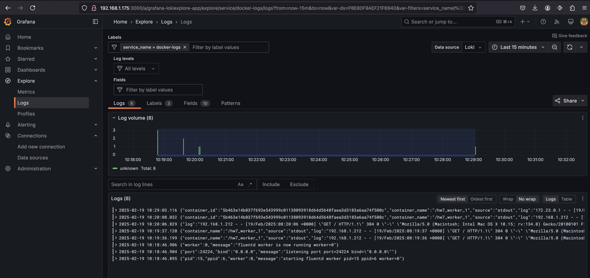

# HW7 Bondaruk Victor

1. На основі попередніх завдань підготував 3 папки з налаштуваннями для контейнерів [nginx](./nginx), [fluentd](./fluentd) та [grafana](./grafana)
2. Створив [docker-compose.yaml](./docker-compose.yaml) з описом власної bridge мережі та 4 контейнерів.
3. Створив файл з налаштуванями середовища .env. Але добавив його у .gitignore. Для запуску необхідно створити цей файл з наступними вмістом
```
GF_SECURITY_ADMIN_PASSWORD=admin
GF_DASHBOARD_DEFAULT_HOME_DASHBOARD_PATH=/etc/grafana/dashboards/default-dashboard.json
GF_SERVER_ROOT_URL=http://localhost:3000
```
4. Запустив проект
```
sudo docker-compose up -d
```
5. Перевірив список запущених контейнерів
```
sudo docker ps
CONTAINER ID   IMAGE                 COMMAND                  CREATED          STATUS          PORTS                                                                                                    NAMES
5b463e14b037   nginx:stable-alpine   "/docker-entrypoint.…"   11 minutes ago   Up 11 minutes   0.0.0.0:8080->80/tcp, :::8080->80/tcp                                                                    hw7_worker_1
894927a3dba6   hw7_fluentd           "tini -- /bin/entryp…"   11 minutes ago   Up 11 minutes   5140/tcp, 0.0.0.0:24224->24224/tcp, 0.0.0.0:24224->24224/udp, :::24224->24224/tcp, :::24224->24224/udp   hw7_fluentd_1
09acfc76fd63   grafana/grafana       "/run.sh"                11 minutes ago   Up 11 minutes   0.0.0.0:3000->3000/tcp, :::3000->3000/tcp                                                                hw7_grafana_1
c1a043bfe3b7   grafana/loki:latest   "/usr/bin/loki -conf…"   11 minutes ago   Up 11 minutes   0.0.0.0:3100->3100/tcp, :::3100->3100/tcp                                                                hw7_loki_1
```
6. Зайшов через браузер або за допомогою curl на 8080 порт віртуальної машини. Ця дія повина генерувати лог в контейнері worker та передавати його через fluentd на loki. Потім цей лог можна побачити у grafana
```
curl http://localhost:8080
<!DOCTYPE html>
<html lang="en">
<head>
    <meta charset="UTF-8">
    <title>HW3</title>
</head>
<body>
    Hello from Victor Bondaruk!
</body>
</html>
```
7. Зайшов у grafana та перевірив логи контейнеру worker
